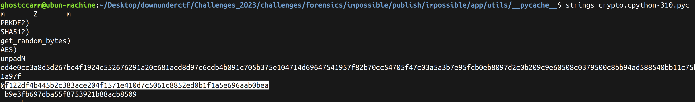

impossible
============

**Category:** misc

**Difficulty:** easy

**Author:** ghostccamm

**Files:**
- [impossible.zip](./publish/impossible.zip)

**Ports Open:** 3000

Lol I thought it would be funny to commit a CTF iceberg taboo and make an unsolvable CTF challenge, then gaslight competitors in support tickets.
  
There is no solution. I don't even know why I **published** files for this challenge anyway.

Author: ghostccamm

---

## Solution

Going through the published files, the challenge creator forgot to remove the `__pycache__` folder in `app/utils/`. The encryption key can be retrieved from `app/utils/__pycache__/crypto.cpython-310.pyc`.

Submitting the key on the challenge server will reveal the flag.