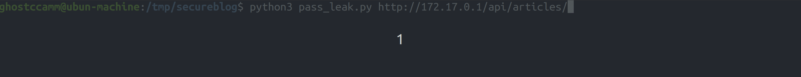
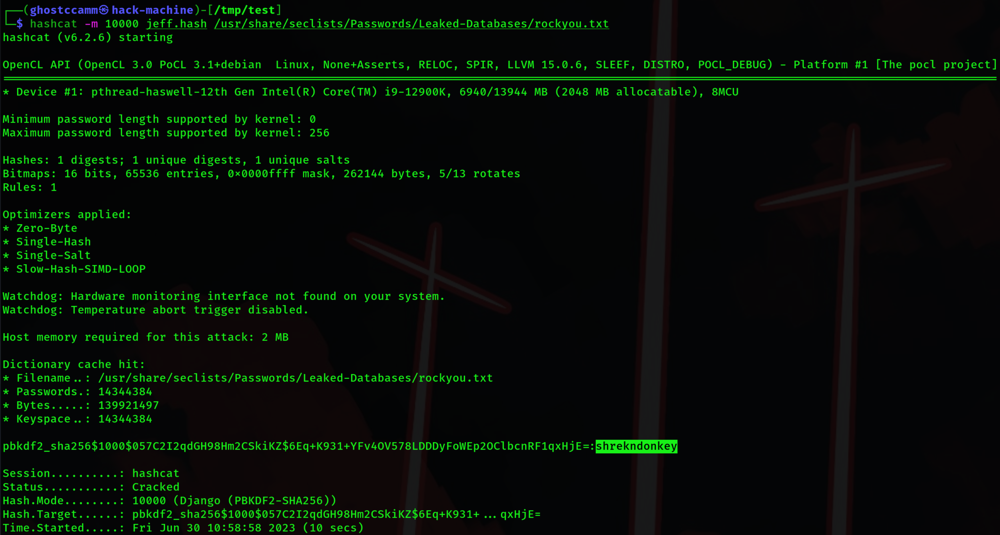
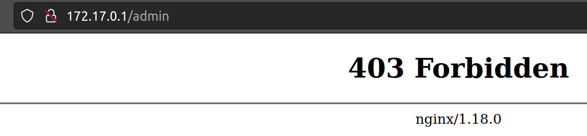
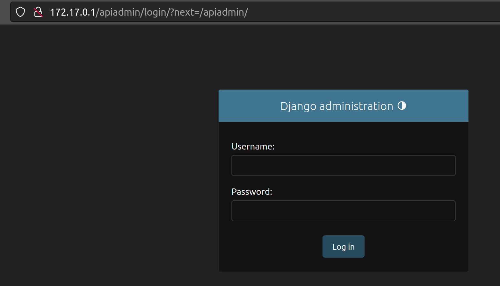
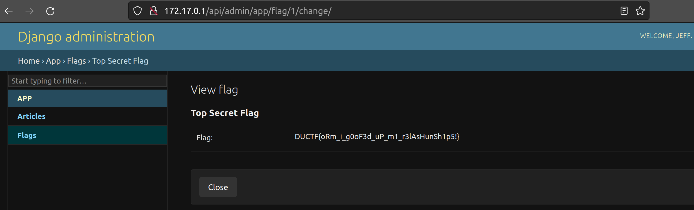

secure blog
============

**Category:** web

**Difficulty:** medium

**Author:** ghostccamm

**Files:**
- [secureblog.zip](./publish/secureblog.zip)

**Ports Open:** 80

Jeff hates frontend web development, but made a sick REST API using Django for his new *secure blog*.

Can you hack into the **admin** portal and grab the flag?

---

## Solution

There are two major parts to solve this challenge.

1. Compromise a Django administrator account.
2. Using the compromised account, figure out a way to bypass the IP address whitelist to access the Django administrator portal

Below I will explain how to solve each section.

### Part 1: Compromising Django administrator account

Viewing the available articles on `/api//articles`, we can see there is a Django administrator account named `jeff` that we should try to compromise.

In the provided source code, students will see that the `Article` model has a relational mapping to a Django user account for the `created_by` field.

```python
from django.db import models
from django.contrib.auth.models import User

class Article(models.Model):
    """
        Test Article model
    """
    title = models.CharField(max_length=255)
    body = models.TextField()
    created_by = models.ForeignKey(User, on_delete=models.CASCADE)

    def __str__(self) -> str:
        return f"{self.title}-{self.created_by.username}"
    
    class Meta:
        ordering = ["title"]
```

Below is the code for the view that query article objects.

```python
from rest_framework.views import APIView
from rest_framework.request import Request
from rest_framework.response import Response
from app.models import Article
from app.serializers import ArticleSerializer

class ArticleView(APIView):
    """
        View for Articles
    """

    def get(self, request: Request, format=None):
        """
            Just return all articles
        """
        articles = Article.objects.all()
        serializer = ArticleSerializer(articles, many=True)
        return Response(serializer.data)
    
    def post(self, request: Request, format=None):
        """
            Query articles
        """
        articles = Article.objects.filter(**request.data)
        serializer = ArticleSerializer(articles, many=True)
        return Response(serializer.data)
```

Of particular interest is `Article.objects.filter(**request.data)`, that directly inserts the user's input into the filter statement. [Django's Object Relational Mapper (ORM) allows filtering objects by **attributes on relational fields**](https://docs.djangoproject.com/en/4.2/ref/models/querysets/#filteredrelation-objects). In addition, a [field lookup can be injected to manipulate querying data](https://docs.djangoproject.com/en/4.2/ref/models/querysets/#field-lookups) that can be exploited to infer values stored. Combining these two facts together, the hashed password can be leaked character by character by querying `created_by__password__startswith`. For an example sending a the following JSON POST requests to `/api//articles` will result in:

*a list of articles since account password hashes on Django start with `pbkdf2`*
```json
{
    "created_by__password__startswith": "pbkdf2"
}
```

*no articles since none of the account password hashes start with `pbkdf2T`*
```json
{
    "created_by__password__startswith": "pbkdf2T"
}
```

This is enough to perform an ORM IDOR injection attack. The solve script [pass_leak.py](./solve/pass_leak.py) will exploit this vulnerability to dump the password hash for the account named `jeff`, as shown in the following GIF.



This dumps the following password hash

```
pbkdf2_sha256$1000$057C2I2qdGH98Hm2CSkiKZ$6Eq+K931+YFv4OV578LDDDyFoWEp2OClbcnRF1qxHjE=
```

Running the following hashcat to crack the password hash saved in a file named `jeff.hash` using the `rockyou.txt` wordlist.

```bash
hashcat -m 10000 jeff.hash /usr/share/seclists/Passwords/Leaked-Databases/rockyou.txt
```

This will crack the password hash and retrieve the password for the account `jeff` is `shrekndonkey`.



So now we know the password for the admin account named `jeff`. However, if we directly visit `/admin` the Nginx web server blocks the request.



## Part 2: Bypassing Nginx `/admin` Block by Exploiting Insecure Regex

Below is the Nginx configuration file that is provided with the source code.

```conf
server {
    listen 80 default_server;
    listen [::]:80 default_server;

    location / {
        index index.html;
        root /var/www/html;
    }

    # I think I did this correctly... had some issues with Django but fixed it now
    location ~ ^/(api|admin) {
        # Make sure no one else can access /admin besides myself
        location ~ ^/admin {
            allow 127.0.0.1;
            deny all;
        }
        proxy_pass http://127.0.0.1:8000;
        proxy_set_header Host 127.0.0.1:8000;
        proxy_set_header Origin http://127.0.0.1:8000;
        proxy_set_header X-Forwarded-For $proxy_add_x_forwarded_for;
    }
}
```

Explaining in english, the `location` block will reverse proxy all requests to the Django web application that start with either `/api` or `/admin`. If the URI path starts with `/admin`, then it will deny all requests except from `127.0.0.1`.

However, if we check the URL route configuration for the django web application in `djangoapp/secureblog/urls.py` we can see that `re_path` is used instead of `path` for matching URL paths on Django.

```py
from django.contrib import admin
from django.urls import re_path
from app.views import ArticleView

# Had some weird issues when combined with NGINX reverse proxy earlier so using re_path instead of path
urlpatterns = [
    re_path('admin/', admin.site.urls),
    re_path('api/articles/', ArticleView.as_view()),
]
```

`re_path` performs a **regex pattern match** when routing URL paths. Since the `admin/` URL pattern is listed at the top, it takes precedence if the Regex patten `admin/` matches the URL path of a request.

Combining the two regex pattern matches to bypass, we start our URL path with `/api` so Nginx will proxy the request Django app and bypass the `^/admin` localhost only block. Then we append `admin/` to the URL path so Django will route the traffic to the admin views. Some example URL paths are `/apiadmin/` or `/api/admin/` as shown below.



Exploiting this, you can log in as `jeff:shrekndonkey` and view the flag that is stored in one of the models. Do note you will need to keep on adding `/api` to the start of the URL path since Django will keep on trying to redirect to `/admin`.

